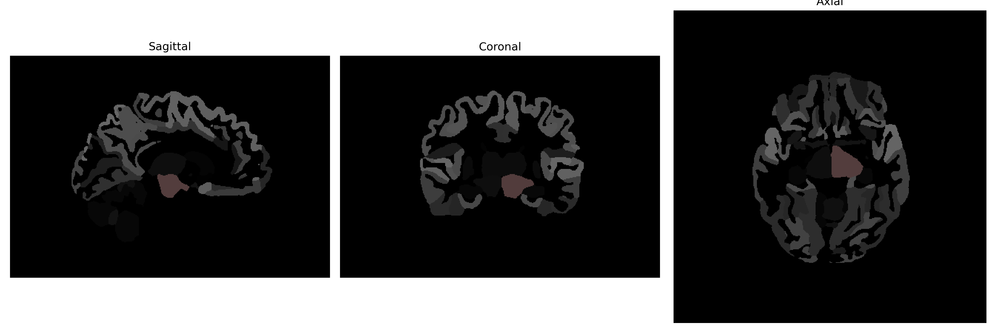

# Ventral-DC

## Overview

The Left Ventral-DC brain region, as defined in the brainCOLOR Atlas, is part of the cingulate cortex located on the ventral side. This area is involved in cognitive processes such as emotion regulation, decision making, and reward-based learning. Structurally, it is situated within the larger framework of the frontal lobes, playing a crucial role in integrating sensory and emotional information. It is interconnected with other cortical and subcortical regions, facilitating comprehensive brain function. Due to its involvement in affecting behavior and psychological states, it is a subject of interest in neuropsychological studies.

There is no direct Wikipedia link for the Left Ventral-DC brain region. However, the cingulate cortex, which includes this region, can be explored further at:
https://en.wikipedia.org/wiki/Cingulate_cortex

*Overview generated by GPT-4o (2026).*

---

**Region ID:** 18  
**Hemisphere:** Left  
**Atlas:** brainCOLOR 

---

## Full Brain – Black Background

**Full Quality Version:** [Download MP4](full_black.mp4)

---

## Full Brain – White Background

**Full Quality Version:** [Download MP4](full_white.mp4)

---

## Hemisphere Only – Black Background

**Full Quality Version:** [Download MP4](hemi_black.mp4)

---

## Hemisphere Only – White Background

**Full Quality Version:** [Download MP4](hemi_white.mp4)

---

## Triplanar View (Centered on ROI)

