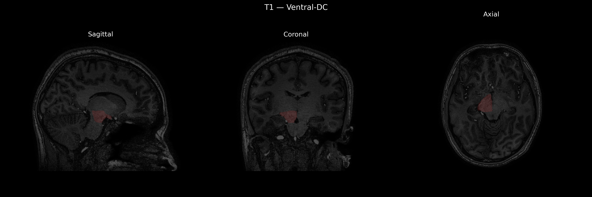
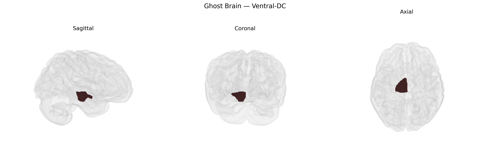

# Ventral-DC
 
## Overview
 
The Right Ventral-DC region in the brainCOLOR atlas refers to the right ventral portion of the diencephalon, a central forebrain division that includes key relay and regulatory nuclei. Functionally, this ventral diencephalic territory contributes to sensorimotor integration, autonomic and endocrine regulation, and the modulation of arousal and motivation through its proximity to hypothalamic and subthalamic structures, as well as ventral thalamic nuclei. It participates in pathways that relay information between the brainstem, basal ganglia, limbic system, and cerebral cortex, influencing movement control, visceral homeostasis, and affective processing. In structural MRI parcellations, this label helps segment deep gray matter around the hypothalamus and subthalamic area for quantitative analysis and connectivity mapping. There is no direct Wikipedia article for “Right Ventral-DC”; a related structure is the [Diencephalon](https://en.wikipedia.org/wiki/Diencephalon).
 
Current genetic and imaging-genetics literature does not specifically isolate the “Right Ventral-DC” subdivision from the brainCOLOR Atlas as an independent target of genome-wide association studies; instead, genetic findings typically concern broader ventral diencephalon or subcortical structures (e.g., hypothalamus, subthalamic region, ventral thalamus) within which this label is anatomically embedded. Large-scale GWAS of subcortical brain volumes (e.g., ENIGMA, UK Biobank–based studies) have identified common variants in genes such as HMGA2, KTN1, DRAM1, DCC, and others that influence diencephalic and adjacent subcortical morphology, with pleiotropic links to cognitive performance, educational attainment, intracranial volume, and general brain development. Polygenic architectures for psychiatric and neurological disorders—including schizophrenia, bipolar disorder, major depression, and Parkinson’s disease—show shared genetic influences with volumes and microstructure of ventral diencephalic and basal ganglia regions, but these results are reported at the level of larger composite ROIs (e.g., “ventral diencephalon,” “thalamus,” “subcortical volume”) rather than the right-sided ventral-DC parcel specifically. Thus, while there is robust evidence that genetic variants affect structure and function across the ventral diencephalon and related subcortical circuits implicated in mood, psychosis, movement disorders, and metabolic traits, no published GWAS or disorder-focused genetic study to date has reported associations explicitly and uniquely for the “Right Ventral-DC” region as defined in the brainCOLOR Atlas.
 
*Overview generated by GPT-4o (2026).*
 
---
 
**Region ID:** 17  
**Hemisphere:** Right  
**Atlas:** brainCOLOR 
 
---
 
## Ventral-DC – Black Background (Full Brain)
 

 
**Full Quality Version:** <a href="full_black.mp4" download>Download MP4</a>
 
---
 
## Ventral-DC – White Background (Full Brain)
 

 
**Full Quality Version:** <a href="full_white.mp4" download>Download MP4</a>
 
---

## Ventral-DC – Black Background (Hemisphere)
 

 
**Full Quality Version:** <a href="hemi_black.mp4" download>Download MP4</a>
 
---
 
## Ventral-DC – White Background (Hemisphere)
 

 
**Full Quality Version:** <a href="hemi_white.mp4" download>Download MP4</a>
 
---

## Triplanar View – T1 Background
 

 
---
 
## Triplanar View – Ghost Brain
 


