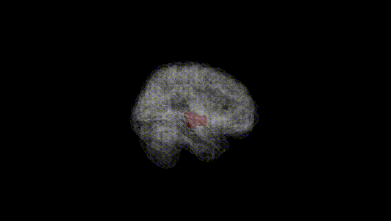
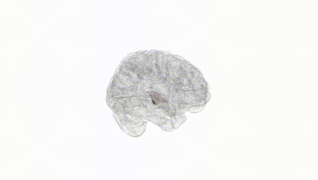
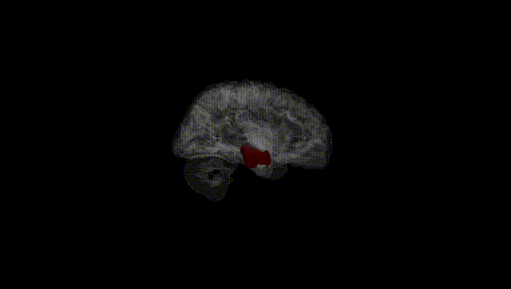
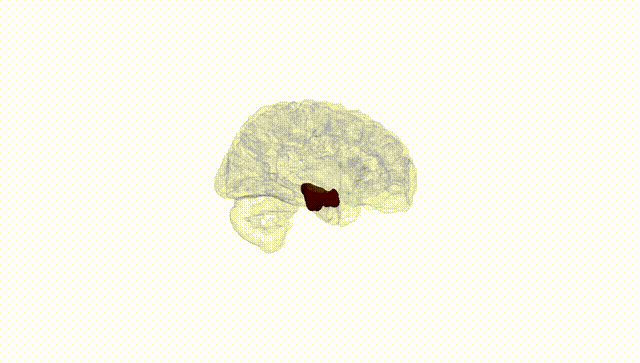
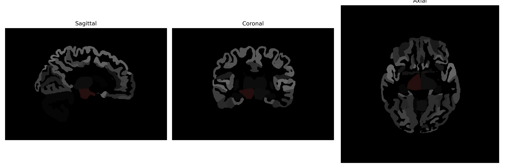

# Ventral-DC

## Overview

The Right Ventral-DC brain region, as identified in the brainCOLOR Atlas, is part of the ventral diencephalon, which is situated in the lower part of the forebrain. This area is primarily associated with neuroendocrine and autonomic functions, as it encompasses important structures such as the hypothalamus and subthalamic nucleus. It plays a critical role in regulating hormonal activity through the pituitary gland, as well as in controlling physiological processes like appetite, temperature regulation, and circadian rhythms. The ventral diencephalon is involved in integrating sensory inputs and motor outputs, contributing to both behavioral responses and homeostatic balance within the body.

There is no direct Wikipedia link to the Right Ventral-DC region; however, an article related to the ventral diencephalon or its major structures like the hypothalamus can be found at https://en.wikipedia.org/wiki/Hypothalamus.

*Overview generated by GPT-4o (2026).*

---

**Region ID:** 17  
**Hemisphere:** Right  
**Atlas:** brainCOLOR 

---

## Full Brain – Black Background

**Full Quality Version:** [Download MP4](full_black.mp4)

---

## Full Brain – White Background

**Full Quality Version:** [Download MP4](full_white.mp4)

---

## Hemisphere Only – Black Background

**Full Quality Version:** [Download MP4](hemi_black.mp4)

---

## Hemisphere Only – White Background

**Full Quality Version:** [Download MP4](hemi_white.mp4)

---

## Triplanar View (Centered on ROI)

